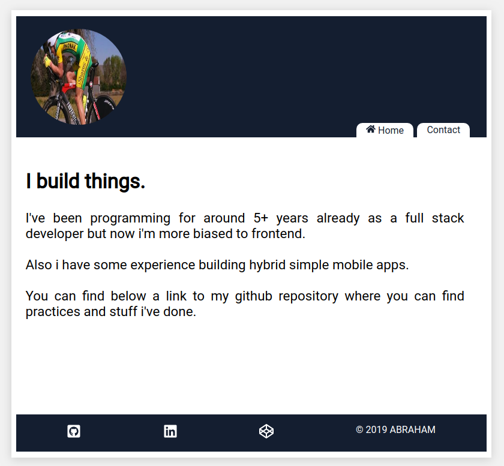

# Portfolio

This is a simple layout and a practice i did using gatsby (the static site generator), react (obviously), flexbox and css grid to build a developer page, where a short self description and a contact page can be modified to our needs to have some presence on the web.

<p align="center">
  
</p>

It's not finished yet, the idea is to create a contact form that when submitted updates a mongodb database leveraging a graphql mutation.

## How to run it ?

First, as usual clone the repo:

```console
foo@bar:~$ git clone https://github.com/wwleak/portfolio.git
```

Then install all the dependencies

```console
foo@bar:~$ npm i
```

Lastly, run the following command

```console
foo@bar:~$ gatsby develop
```
